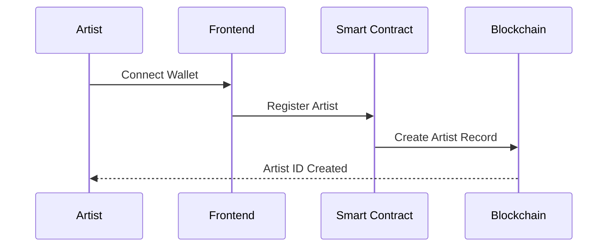
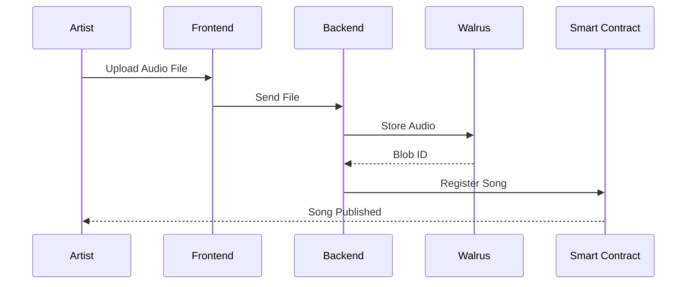
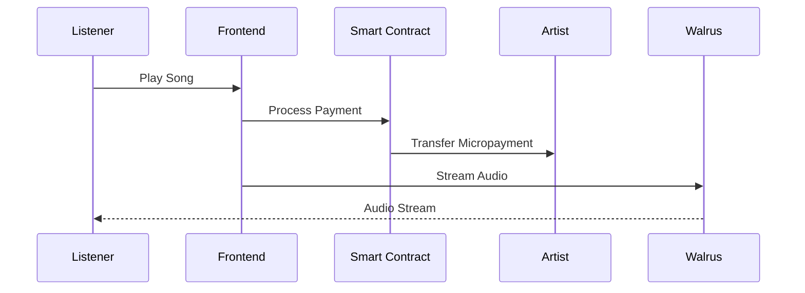

# 🎵 WalTune

**Decentralized Music Streaming Platform**

A revolutionary music streaming platform that empowers artists through direct micropayments, decentralized storage, and blockchain-powered transparency.

[](https://sui.io)
[](https://walrus.site)
[](https://nextjs.org)
[](https://www.typescriptlang.org)

---

## 🎯 Problem Statement

Current music streaming platforms exploit creators:
- Artists earn **less than ₹0.10 per stream**
- Payments delayed by **30-90 days**
- Platforms take **30-45% revenue cuts**
- **No transparency** or ownership for artists
- Music stored on **centralized servers** with no proof of authenticity

---

## 💡 Solution

WalTune revolutionizes music streaming with:

- **Walrus** → Decentralized audio storage with content addressing
- **Sui Blockchain** → Smart contracts for artist identity, song registry, and payments
- **Direct Micropayments** → Pay-per-play model with instant artist earnings
- **No Middlemen** → Artists keep their earnings, listeners pay fair prices

### The Model

```
Listener loads wallet → Plays song → Instant micropayment → Artist receives funds
```

No subscriptions. No intermediaries. Just fair, transparent creator monetization.

---

## ✨ Features

### 🎤 For Artists
- **On-chain Identity**: Register as an artist with immutable blockchain records
- **Upload Songs**: Store audio files on Walrus (decentralized, permanent storage)
- **Set Your Price**: Define per-play cost (e.g., ₹0.05 per stream)
- **Real-time Earnings**: Receive instant micropayments for every play
- **Full Transparency**: Track all plays and earnings on-chain

### 🎧 For Listeners
- **Simple Wallet Loading**: Preload balance for seamless streaming
- **Pay Per Play**: Only pay for what you listen to
- **Support Artists Directly**: 100% of streaming fees go to creators
- **Transparent History**: View all your plays and payments

### 🏗️ Platform Features
- Fully decentralized audio storage
- Smart contract-based payment routing
- Trustless micropayments
- Modern, intuitive music player UI
- Mobile-responsive design

---

## 🏗️ Architecture

```
┌─────────────────────────┐
│      FRONTEND           │
│   Next.js + Sui SDK     │
└───────────┬─────────────┘
            │
            │ API Calls
            │
┌───────────▼─────────────┐
│       BACKEND           │
│  Node.js + TypeScript   │
└─────┬────────────┬──────┘
      │            │
      │            │
┌─────▼──────┐  ┌─▼───────────┐
│  WALRUS    │  │ SUI NETWORK │
│  Storage   │  │  Contracts  │
└────────────┘  └─────────────┘
   │                   │
   │   Audio Files     │  Metadata
   │   (Decentralized) │  Payments
   │                   │  Identity
```

---

## 🚀 Quick Start

### Prerequisites

- Node.js 18+
- npm or yarn
- Sui Wallet
- Walrus testnet access

### Installation

1. **Clone the repository**
   ```bash
   git clone https://github.com/Vikram-Singh0/WalTune.git
   cd WalTune
   ```

2. **Setup Backend**
   ```bash
   cd backend
   npm install
   cp .env.example .env
   # Configure your environment variables
   npm run dev
   ```

3. **Setup Frontend**
   ```bash
   cd frontend
   npm install
   cp .env.example .env.local
   # Configure your environment variables
   npm run dev
   ```

4. **Deploy Contracts** (Optional)
   ```bash
   cd contracts
   sui move build
   sui client publish --gas-budget 100000000
   ```

### Environment Variables

**Backend** (`backend/.env`):
```env
PORT=3001
WALRUS_PUBLISHER_URL=https://publisher.walrus-testnet.walrus.space
WALRUS_AGGREGATOR_URL=https://aggregator.walrus-testnet.walrus.space
WALRUS_EPOCHS=5
SUI_NETWORK=testnet
```

**Frontend** (`frontend/.env.local`):
```env
NEXT_PUBLIC_SUI_NETWORK=testnet
NEXT_PUBLIC_API_URL=http://localhost:3001
NEXT_PUBLIC_SUI_RPC_URL=https://fullnode.testnet.sui.io:443
```

---

## 📁 Project Structure

```
WalTune/
├── frontend/              # Next.js frontend application
│   ├── app/              # App router pages
│   ├── components/       # React components
│   ├── lib/             # Utilities and configurations
│   └── types/           # TypeScript type definitions
│
├── backend/              # Node.js backend service
│   ├── src/
│   │   ├── controllers/ # API controllers
│   │   ├── routes/      # Express routes
│   │   ├── services/    # Business logic
│   │   ├── sui/         # Sui blockchain integration
│   │   └── walrus/      # Walrus storage integration
│   └── package.json
│
└── contracts/            # Sui Move smart contracts
    ├── artist.move      # Artist registration & identity
    ├── song_registry.move # Song metadata & tracking
    └── payment.move     # Micropayment logic
```

---

## 🔧 Tech Stack

### Blockchain & Storage
- **[Sui](https://sui.io)** - High-performance blockchain
- **[Move](https://github.com/move-language/move)** - Smart contract language
- **[Walrus](https://walrus.site)** - Decentralized storage network

### Frontend
- **[Next.js 16](https://nextjs.org)** - React framework
- **[TypeScript](https://www.typescriptlang.org)** - Type safety
- **[Tailwind CSS](https://tailwindcss.com)** - Styling
- **[@mysten/dapp-kit](https://sdk.mystenlabs.com/dapp-kit)** - Sui wallet integration
- **Lucide React** - Icon library

### Backend
- **[Node.js](https://nodejs.org)** - Runtime environment
- **[Express](https://expressjs.com)** - Web framework
- **[TypeScript](https://www.typescriptlang.org)** - Type safety
- **Walrus SDK** - Storage operations
- **Sui SDK** - Blockchain interactions

---

## 🎬 How It Works

### 1. Artist Registration


### 2. Song Upload


### 3. Song Play & Payment


---

## 🛠️ Development

### Run Tests
```bash
# Backend tests
cd backend
npm test

# Contract tests
cd contracts
sui move test
```

### Build for Production
```bash
# Frontend
cd frontend
npm run build

# Backend
cd backend
npm run build
```

---


## 📄 License

This project is licensed under the MIT License - see the [LICENSE](LICENSE) file for details.

---


<div align="center">

### Built with ❤️ by Vikram for creators and music lovers

**Empowering artists through decentralization**

[Website](#) • [Documentation](#) • [Demo](#)

</div>
